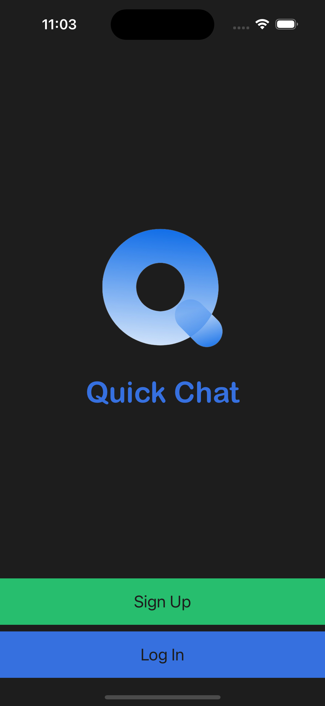
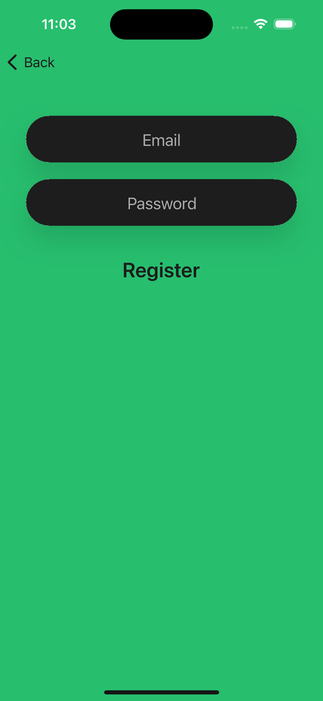
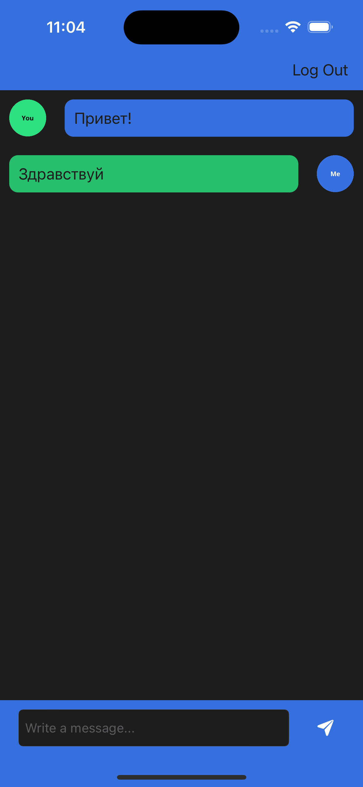

# Quick Chat

## Description

It's a chat application built using Google Firebase. There are abilities to sign up or log in via email and chat with other logged users.

## Main features

* Integration of third party libraries using Swift Package Manager.
* Storing data in the cloud using Firebase Firestore.
* Querying and sorting the Firebase database.
* Using Firebase for user authentication, registration and login.
* Using UITableViews and setting their data sources and delegates.
* Implementing custom views using .xib files to modify native design components.

## Simulator screenshots

   
